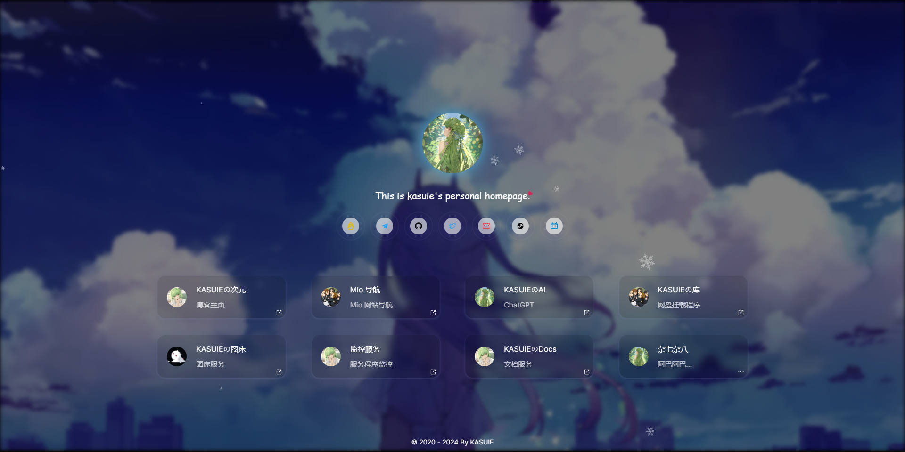

<!--
 * @Author: kasuie
 * @Date: 2024-05-20 19:31:13
 * @LastEditors: kasuie
 * @LastEditTime: 2024-05-26 18:34:25
 * @Description:
-->

# 个人主页

remio-home(homepage): 基于配置的个人主页

预览：

> 

[演示 Demo](https://remio-home.vercel.app)

## 部署

### 容器部署

拉取镜像

```sh
docker pull kasuie/remio-home
```

启动容器

```sh
docker run --name remio-home -p 3000:3000 -v /usr/local/config:/remio-home/config -d kasuie/remio-home:latest
```

注意 `-v /usr/local/config:/remio-home/config` 是挂载宿主机目录，`/usr/local/config` 需要修改为你想要挂载的资源目录，端口和容器名可根据需要调整，其他的需要保持不变。

首次启动成功后，需要在你挂载的目录里新建`config.json`文件，在里面填写你站点的配置信息，可参考仓库里 `/src/config/config.json` 进行修改，下方有参数说明可进行查看。

### 部署到Vercel

[](https://vercel.com/new/clone?repository-url=https://github.com/kasuie/remio-home&project-name=remio-home&repository-name=remio-home)

点击上方按钮即可，完成后，回到自己创建的仓库里，按需修改 `/src/config/config.json` 文件即可，以下是一些参数说明：

| 字段        | 类型      | 必填 | 说明                                                                             |
| ----------- | --------- | ---- | :--------------------------------------------------------------------------------:|
| name        | string    | 是   | 站点标题                                                                         |
| domain      | string    | 是   | 站点链接                                                                         |
| keywords    | string    | 否   | 站点关键词                                                                       |
| description | string    | 否   | 站点描述性信息                                                                    |
| avatar      | string    | 是   | 主页头像                                                                         |
| bg          | string    | 是   | PC背景图                                                                         |
| mbg         | string    | 是   | 移动端背景图                                                                      |
| bgStyle     | string    | 否   | 背景飘浮风格。可选值：`sakura` 或 `snow`，也可自行填写飘浮物资源图片                 |
| subTitle    | string    | 否   | 站点头像下的次标题。可填入一言API，例如：`https://v1.hitokoto.cn?c=a&c=b&c=c`     |
| footer      | string    | 否   | 底部文字                                                                         |
| links       | Link[]    | 是   | 社交媒体的链接                                                                    |
| sites       | Site[]    | 是   | 项目或者其他站点链接                                                              |
| pwa         | PWA       | 是   | PWA 配置。测试用，暂不需要填写                                                     |

#### Link 类型说明

| 字段  | 类型   | 必填 | 说明   |
| ----- | ------ | ---- | ------ |
| title | string | 是   | 标题   |
| color | string | 否   | 颜色   |
| url   | string | 是   | 链接   |
| icon  | string | 否   | 图标链接 |

#### Site 类型说明

| 字段  | 类型   | 必填 | 说明   |
| ----- | ------ | ---- | ------ |
| icon  | string | 是   | 图标链接 |
| title | string | 是   | 标题   |
| url   | string | 否   | 链接   |
| desc  | string | 否   | 描述   |


## 本地启动

安装依赖

```js
// 需要先安装pnpm: https://pnpm.io/
pnpm install
```

本地启动

```js
pnpm dev
```

打包

```js
pnpm build
```
